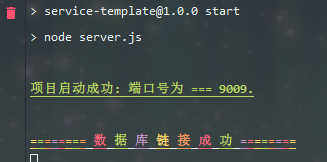
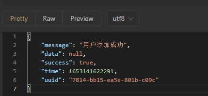
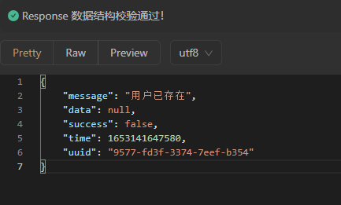

# Node Service Template （Node服务模板）

#### 介绍
> NodeJs基于Express框架打造简单的Api请求接口，链接MongoDb实现基本的增删改查业务逻辑。是一个入门级的小项目；

#### 什么情况下会使用Node?
- 在不了解其他后端（`Java, PHP, Python...`）语言的情况下，前端需要一些接口参数，可以使用`Node`来模拟实现；
- 项目小，需要服务器，可以使用`Node-Express`自己微服务器；从而实现API接口调用；
- 微服务，文件管理，操作系统的情况下...

#### 为什么会选择Node?
> 首先，公司项目中老项目搭建Node路由， 从而实现JQ + Node = 微电商系统
>
> 自己动手搭建使用Node作为API服务器；从 Linux + 宝塔面板 + Vite/Webpack + Vue + Node(服务层) + jenkins(部署) ；0-1实现一个博客系统网站，
> 
> 打破前端在不了解后端语言的情况下，将Node作为微后端，实现API接口的调用;

#### 软件架构
> Node搭载Express框架， 使用自带中间件Router, 将Router作为api地址，从而实现api接口的调用
> 
> 第三方工具库， 二次封装，如：dayjs, qiniu...

#### 安装教程
> 本项目模板使用 pnpm, 避免npm/cnpm和yarn 因某些包拉去不到的问题， 节省磁盘空间 [详情查看PNPM](https://www.pnpm.cn/)
1.  拉取：`pnpm install`
2.  启动服务：`node server.js` 或者在 `package.json`中运行`start`命令;
3.  添加包： `pnpm add [packageName]`, 如： `pnpm add express`;

#### 重要文件说明
1. `models`: 存放数据库数据表需要的数据字段， 如用户数据有：姓名，年龄，性别等等；
2. `proxy`: 通过路由回调操作数据库，如：添加用户，删除用户，编辑用户等等；
3. `router`: 路由回调的处理函数， 在处理函数中可操作数据库；
4. `api_router_v1.js`: 路由文件(API地址链接)；
5. `gloval_config.js`: 全局的配置文件， 如：端口，IP地址，七牛配置文件等等；

#### 使用说明
> 首先命令启动服务，启动成功之后 默认的地址为: `http://localhost:9009`, `9009`端口可在`gloval_config.js`文件中自定义;
> 
> 服务启动成功之后会默认链接 `mongoDb`数据库;
> 
> 通过`apiFox`测试其中添加用户的接口，看看数据库中是否会有该数据;
>

#### 使用说明效果图如下：
##### 服务启动以及链接数据库

##### `apiFox`操作

##### 运行之后，查看回调
> 首次添加
> 

> 
> 第二次一样的账号密码添加
> 

##### 数据库命令查询结果

#### 参与贡献
1.  创建代码仓库
2.  新建 master 分支
3.  提交代码

